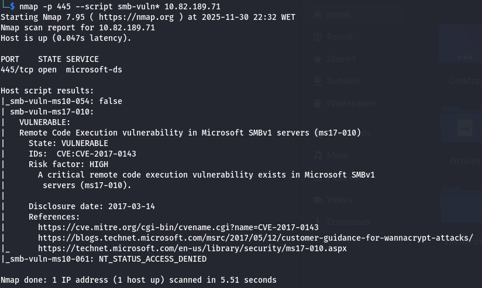
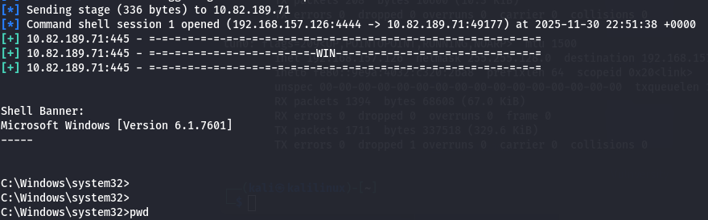
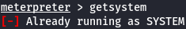
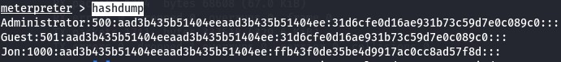
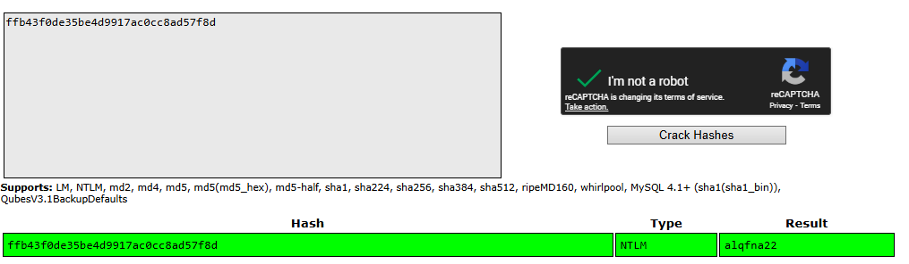

# Project: Blue Penetration Test (TryHackMe)

**Date:** 1st November 2025
**Target:** 10.82.189.71 (Blue)
**Tools Used:** Nmap, Metasploit, Meterpreter, CrackStation
**Vulnerability Explored:** MS17-010 (EternalBlue)

## 1\. Executive Summary

**Objective:** Conduct a black-box penetration test on the target host "Blue" to identify vulnerabilities, gain administrative access, and demonstrate post-exploitation capabilities such as password cracking and flag retrieval.

**Result:** The assessment identified a critical **SMBv1 vulnerability (MS17-010)** known as "EternalBlue." This allowed for unauthenticated Remote Code Execution (RCE), resulting in immediate `NT AUTHORITY\\SYSTEM` access.

---

## 2\. Technical Findings \& Walkthrough

### Step 1: Reconnaissance \& Enumeration

**Objective:** Identify open ports and potential vulnerabilities.

**Methodology:**
I performed a service scan using **Nmap** to identify active services and potential operating system details. I specifically looked for vulnerabilities in the SMB protocol.

```bash
nmap -sV 10.82.189.71
nmap -p 445 --script smb-vuln\* 10.82.189.71
```

**Findings:**

**Open Ports:** 3 ports were identified below port 1000.

**Vulnerability:** The Nmap script engine confirmed the machine is vulnerable to MS17-010 (EternalBlue).



### Step 2: Exploitation (EternalBlue)

**Vulnerability:** MS17-010 (SMBv1 Remote Code Execution) **Severity:** Critical

**Methodology:** Using Metasploit, I searched for the EternalBlue exploit module.

**Exploitation Steps:**

**Module Selection:** I selected `exploit/windows/smb/ms17\_010\_eternalblue`.

**Configuration:**

* Set **RHOSTS** to 10.82.189.71.
* Set **PAYLOAD** to `windows/x64/shell/reverse\_tcp` to catch a stable shell.

**Execution:** Ran the exploit, which successfully triggered the buffer overflow and returned a command shell.



### Step 3: Post-Exploitation \& Privilege Escalation

**Objective:** Upgrade the shell to Meterpreter and stabilize access.

**Methodology:** Although the initial exploit provided system access, a raw command shell is limited. I upgraded to a Meterpreter session for better post-exploitation tools.

**Steps Taken:**

* **Shell Conversion:** I utilized the post-exploitation module `post/multi/manage/shell\_to\_meterpreter`.
* **Session Management:** Selected the active session created by the exploit.
* **Verification:** Ran `getsystem` and `whoami` to confirm `NT AUTHORITY\\SYSTEM` privileges.



* **Migration:** To ensure stability, I listed running processes (`ps`) and migrated into a stable system process:
* **Target Process:** `Ec2Config.exe` (PID: 1596) running as SYSTEM.
* **Command:** `migrate 1596`

### Step 4: Credential Dumping \& Cracking

**Objective:** Extract and crack user hashes.

**Methodology:** With system-level privileges, I dumped the SAM database hashes using Meterpreter.

**Steps Taken:**

* **Hashdump:** Ran the `hashdump` command.



* **User Identification:** Identified a non-default user named **Jon**.
* **Cracking:** Copied the NTLM hash and used **CrackStation** (an online rainbow table) to recover the plaintext password.



**Cracked Password:** `alqfna22`

### Step 5: Flag Retrieval

**Objective:** Locate critical system files (Flags).

**Findings:** Using the elevated shell, I navigated the file system to locate the three required flags:

**Flag 1 (System Root):** Found at `C:\\`

`flag{access\_the\_machine}`

**Flag 2 (SAM Location):** Found at `C:\\Windows\\System32\\config`

`flag{sam\_database\_elevated\_access}`

**Flag 3 (Admin Documents):** Found at `C:\\Users\\Jon\\Documents`

`flag{admin\_documents\_can\_be\_valuable}`

## 3\. Remediation \& Recommendations

### 1. Patch MS17-010 (Critical)
The target system is vulnerable to EternalBlue, a buffer overflow in the SMBv1 protocol. This was the primary entry point for the compromise.

**Immediate Action:** Apply Microsoft Security Bulletin MS17-010 immediately.

**Configuration Change:** Disable SMBv1 entirely via the Windows Registry or Group Policy, as it is an obsolete and insecure protocol. Ensure the network uses SMBv2 or SMBv3.

### 2. Enforce Strong Password Policies (High)
The user Jon had a weak password (alqfna22) that was cracked instantly using a public rainbow table.

**Action:** 
* Implement a password policy requiring a minimum length (e.g., 14+ characters) and complexity (uppercase, lowercase, numbers, and symbols).
* Enforce regular password rotation and audit user accounts for weak credentials.

### 3. Principle of Least Privilege (Medium)
The successful exploitation immediately granted NT AUTHORITY\\SYSTEM (highest level) privileges.

**Action:** Ensure that services and applications run with the minimum necessary permissions (Service Accounts) rather than as System or Administrator, to limit the impact of a potential compromise.

---

**Disclaimer**
This project was performed on the TryHackMe "Blue" room for educational purposes to demonstrate the impact of unpatched SMB vulnerabilities.

