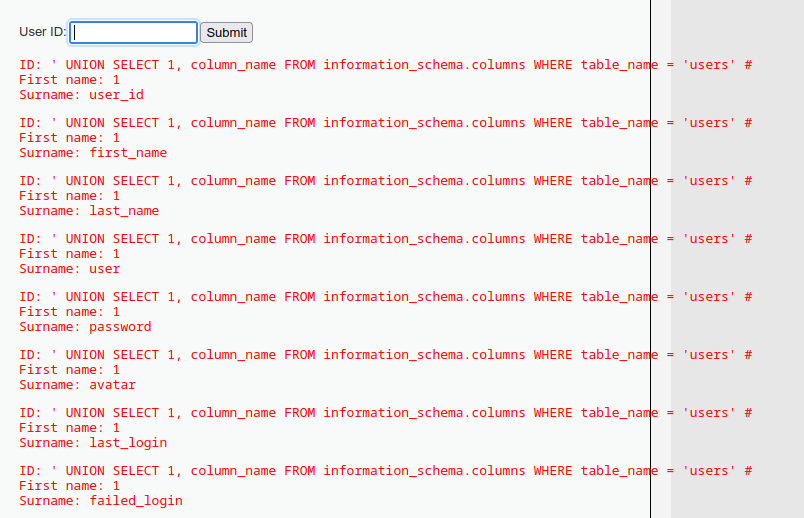
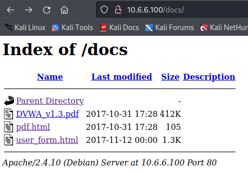
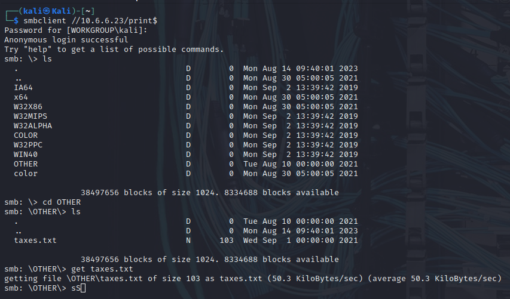
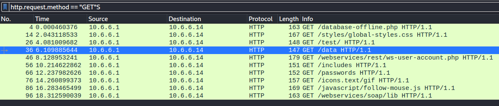

# 🛡️ Project: Internal Network Penetration Test (Capstone)

## 1. Executive Summary
**Objective:** Conduct a black-box penetration test on the client's internal network (Subnets: 10.6.6.0/24 and 172.17.0.0/24) to identify vulnerabilities in web applications, network services, and traffic security.
**Result:** Critical vulnerabilities were identified, including SQL Injection, Open SMB Shares, Directory Indexing, and Unencrypted Network Traffic. Successful exploitation allowed for administrative access and data exfiltration.

---

## 2. Technical Findings & Walkthrough

### 🚩 Challenge 1: Web Application SQL Injection
**Vulnerability:** SQL Injection (SQLi)
**Severity:** Critical
**Host:** 10.6.6.100 (Web Server)

**Methodology:**
I began by browsing to the target web server. After logging in with default credentials (`admin/password`), I located a user search input. I tested for SQL injection vulnerability by injecting a standard union-based payload.

**Exploitation Steps:**
1.  **Enumeration:** I determined the number of columns and table names using the following payload:
    ```sql
    ' UNION SELECT 1, column_name FROM information_schema.columns WHERE table_name = 'users' #
    ```
    

2.  **Data Exfiltration:** I extracted the usernames and password hashes:
    ```sql
    ' UNION SELECT 1, CONCAT(user, ':', password) FROM users #
    ```
    *Resulting Hash:* `gordonb:e99a18c428cb38d5f260853678922e03`

3.  **Password Cracking:** Using **Hashcat** with the `rockyou.txt` wordlist, I cracked the MD5 hash.
    ```bash
    sudo hashcat -m 0 -a 0 target_hash.txt /usr/share/wordlists/rockyou.txt
    ```
    *Cracked Password:* `abc123`

4.  **System Access:** I used the compromised credentials to SSH into the internal server.
    ```bash
    ssh gordonb@172.17.0.2
    ```
5.  **Data Access:** Successfully located the sensitive file `hkxisx.txt` containing the flag `4E9f12`.

**Remediation:**
* **Parameterized Queries:** Use prepared statements to separate code from data.
* **Input Validation:** Sanitize all user inputs on the server side.
* **Principle of Least Privilege:** Limit database account permissions.

---

### 🚩 Challenge 2: Web Server Misconfiguration
**Vulnerability:** Directory Indexing / Information Disclosure
**Severity:** Medium
**Host:** 10.6.6.100

**Methodology:**
I performed a vulnerability scan using `nmap` scripts to enumerate the HTTP service structure.

**Exploitation Steps:**
1.  **Scanning:**
    ```bash
    nmap -sV --script=http-enum 10.6.6.100
    ```
2.  **Discovery:** The scan revealed several accessible directories: `/docs`, `/config`, and `/external`.
3.  **Exploitation:** Navigating to `http://10.6.6.100/docs/` revealed that directory listing was enabled. I found the file `user_form.html` which contained sensitive data.

    *Flag:* `18xf9-4z`
    

**Remediation:**
* **Disable Directory Indexing:** Configure the web server (Apache/Nginx) to prevent listing directory contents.
* **Default Index Files:** Ensure every directory has a default `index.html` or `index.php`.

---

### 🚩 Challenge 3: Unsecured SMB Shares
**Vulnerability:** Anonymous SMB Access
**Severity:** High
**Host:** 10.6.6.23

**Methodology:**
I scanned the network `10.6.6.0/24` to identify file sharing services.

**Exploitation Steps:**
1.  **Network Scanning:**
    ```bash
    sudo nmap -sN 10.6.6.0/24
    ```
    *Target Identified:* `10.6.6.23`

2.  **Enumeration:** I used `enum4linux` to list available shares.
    ```bash
    enum4linux -S 10.6.6.23
    ```
    *Result:* Found shares `homes`, `workfiles`, and `print$`.

3.  **Access:** I connected to the `print$` share without providing a password (anonymous login).
    ```bash
    smbclient //10.6.6.23/print$
    ```
    

4.  **Exfiltration:** Downloaded `taxes.txt` containing the flag `A9!15wa2`.

**Remediation:**
* **Disable Anonymous Access:** Configure `smb.conf` to require valid authentication for all shares.
* **Network Segmentation:** Isolate critical file servers from general user subnets.

---

### 🚩 Challenge 4: Unencrypted Traffic Analysis (PCAP)
**Vulnerability:** Cleartext Data Transmission (HTTP)
**Severity:** High

**Methodology:**
I analyzed a provided packet capture file (`SA.pcap`) using Wireshark to inspect network traffic.

**Exploitation Steps:**
1.  **Analysis:** I filtered the traffic for HTTP requests (`http.request.method == "GET"`).
    

2.  **Findings:** I observed cleartext traffic directed to target IP `10.6.6.14`. The traffic revealed directory enumeration attempts on `/test`, `/data`, `/webservices`, and `/passwords`.

3.  **Data Extraction:** A specific GET request for `http://10.6.6.14/data/accounts.xml` returned a file containing "Users credentials".

    *Flag:* `zz90014x`

**Remediation:**
* **Enforce Encryption:** Use HTTPS (TLS/SSL) for all web traffic to prevent eavesdropping.
* **Access Control:** Implement server-side access controls to deny direct access to sensitive XML files.