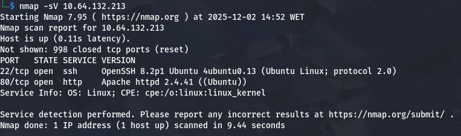
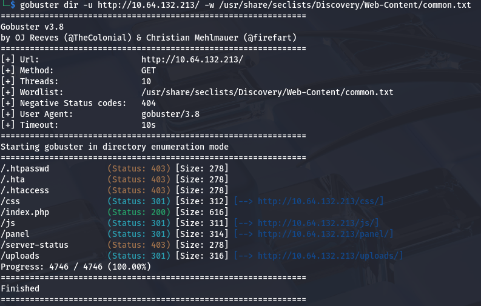
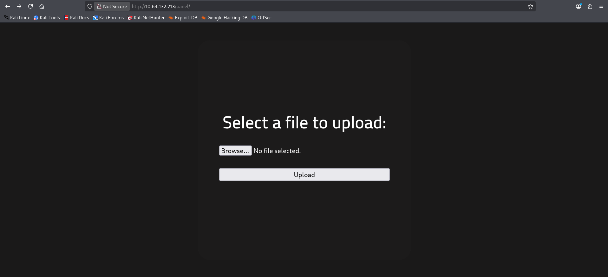
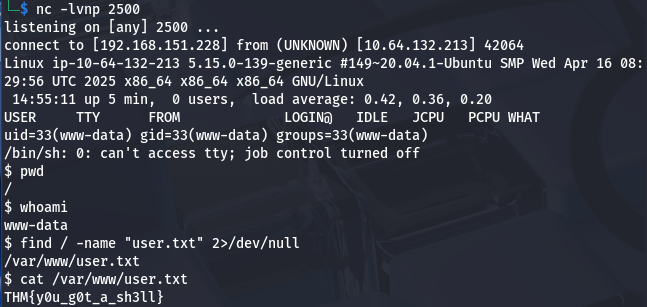
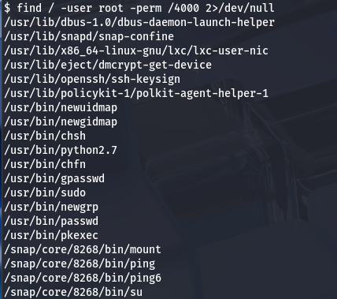
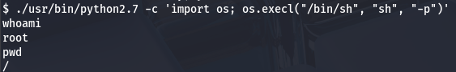
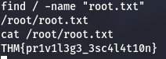

# Project: RootMe Penetration Test (TryHackMe)

**Date:** December 2025

**Target:** 10.64.132.213 (RootMe)

**Tools Used:** Nmap, Gobuster, Netcat, GTFOBins

**Vulnerability Explored:** Unrestricted File Upload \& SUID Privilege Escalation

## 1\. Executive Summary

**Objective:** Conduct a black-box penetration test on the target host "RootMe" to identify vulnerabilities, gain initial access via a web application flaw, and escalate privileges to root.

**Result:** The assessment identified a critical **File Upload Vulnerability** on the web server, allowing for Remote Code Execution (RCE) by bypassing extension filters. Additionally, a misconfigured **SUID permission** on the Python binary allowed for trivial privilege escalation to the root user.


## 2\. Technical Findings \& Walkthrough

### Step 1: Reconnaissance \& Enumeration

**Objective:** Identify open ports and hidden directories.

**Methodology:**
I performed a service scan using **Nmap** to identify active services on the target.

```bash
nmap -sV 10.64.132.213
```

**Findings:**
Open Ports: 2 ports were identified as open.

* **22 (SSH):** Standard OpenSSH service.
* **80 (HTTP):** Apache Web Server version 2.4.41.




**Web Enumeration:** Using **Gobuster**, I searched for hidden directories on the web server.

```bash
gobuster dir -u http://10.64.132.213/ -w /usr/share/seclists/Discovery/Web-Content/common.txt
```

**Result:** I discovered a hidden directory `/panel/` and an `/uploads/` directory. The `/panel/` page contained a file upload form.







### Step 2: Initial Compromise (File Upload Bypass)

**Vulnerability:** Remote Code Execution via File Upload
**Severity:** Critical

**Methodology:** The upload form blocked standard `.php` files. I attempted to bypass this restriction by changing the file extension.

**Exploitation Steps:**

1. **Payload Preparation:** I downloaded the standard PHP Reverse Shell script (from pentestmonkey).
2. **Bypass:** I renamed the file from `shell.php` to `shell.phtml` to bypass the server's filter.
3. **Execution:** I uploaded the file successfully via `/panel/`. I then started a Netcat listener (`nc -lvnp 2500`) and navigated to `/uploads/shell.phtml` to trigger the script.
4. **Access:** The shell connected back, granting me access as the `www-data` user.

**Proof of Concept:** I located the user flag in the system.

**User Flag:** `THM{y0u\_g0t\_a\_sh3ll}`.




### Step 3: Privilege Escalation

**Vulnerability:** SUID Binary Misconfiguration (Python)
**Severity:** Critical

**Methodology:** I searched for files with the SUID bit set, which allows a user to execute the file with the permissions of the file owner (in this case, root).

```bash
find / -user root -perm /4000 2>/dev/null
```

**Findings:** The search revealed `/usr/bin/python2.7` had SUID permissions enabled. This is highly unusual and dangerous, as Python can interface with the operating system kernel.




**Exploitation:** I consulted **GTFOBins** to identify a privilege escalation technique for Python SUID.

**Command Execution:** I ran the following command to spawn a system shell using the elevated Python binary.

```bash
/usr/bin/python2.7 -c 'import os; os.execl("/bin/sh", "sh", "-p")'
```

**Result:** The command successfully spawned a shell as `root`.




**Root Flag:** Located at `/root/root.txt`.

**Flag:** `THM{pr1v1l3g3\_3sc4l4t10n}`.




## 3\. Remediation \& Recommendations

1. **Secure File Uploads (Critical)**
   The web server allows the upload of executable code (e.g., `.phtml`).

   * **Action:** Implement a strict allow-list for file extensions (e.g., only `.jpg`, `.png`).
   * **Action:** Configure the web server (Apache) to disable script execution in the `/uploads/` directory.

2. **SUID Configuration (Critical)**
   The `python` binary has the SUID bit set, allowing any user to become root.

   * **Action:** Remove the SUID bit from Python immediately: `chmod u-s /usr/bin/python`.


---


\### Disclaimer


\*This project was performed on the TryHackMe "Simple CTF" room for educational purposes.\*

