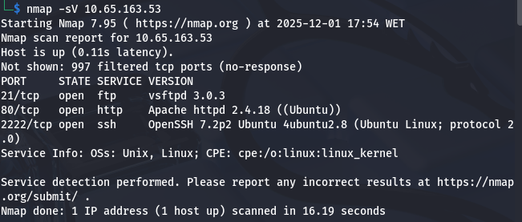
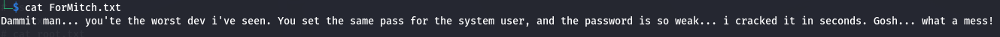
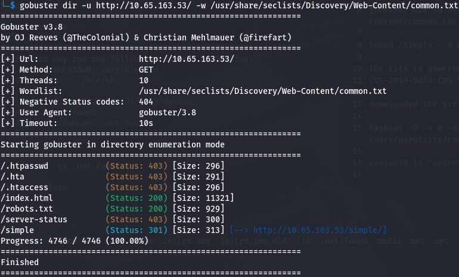
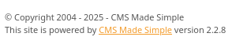
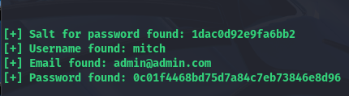
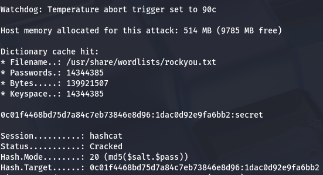
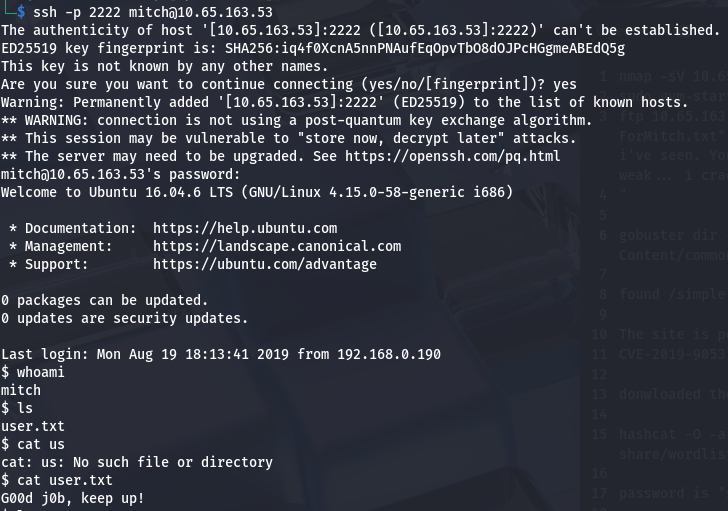
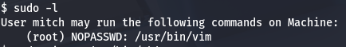
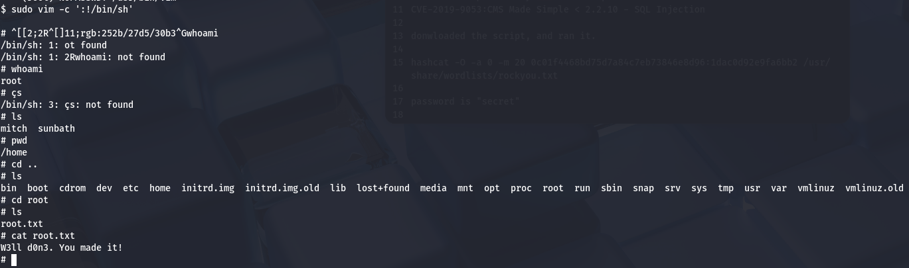

# Project: Simple CTF Penetration Test (TryHackMe)

**Date:** December 2025

**Target:** `10.65.163.53` (Simple CTF)

**Tools Used:** Nmap, Gobuster, Searchsploit, Hashcat, GTFOBins

**Vulnerability Explored:** SQL Injection (CVE-2019-9053) \& SUID Misconfiguration

## 1\. Executive Summary

**Objective:** Conduct a black-box penetration test on the target host "Simple CTF" to identify vulnerabilities, gain initial access via web exploitation, and escalate privileges to root.

**Result:** The assessment identified a critical **SQL Injection** vulnerability in the "CMS Made Simple" application (CVE-2019-9053), which allowed for credential dumping. Furthermore, a misconfigured **sudo permission** on the `vim` binary allowed for privilege escalation to the root user.

## 2\. Technical Findings \& Walkthrough

### Step 1: Reconnaissance \& Enumeration

**Objective:** Identify open ports, services, and hidden directories.

**Methodology:**
I performed a service scan using **Nmap** to identify active services and ports on the target.

```bash
nmap -sV 10.65.163.53
```

**Findings:**

* **Open Ports:**

  * `21` (FTP): Anonymous login enabled.
  * `80` (HTTP): Apache Web Server.
  * `2222` (SSH): Running on a non-standard port.



* **FTP Analysis:**

  * I logged in as anonymous and downloaded the file `ForMitch.txt`.
  * **Content:** The note hinted at a weak system password and a user named "Mitch".




* **Web Enumeration:**

  * Using **Gobuster**, I discovered a hidden directory named `/simple`.

```bash
gobuster dir -u http://10.65.163.53/ -w /usr/share/seclists/Discovery/Web-Content/common.txt
```

* **Result:** The directory `/simple` hosted a **CMS Made Simple** application, version `2.2.8`.





### Step 2: Exploitation (SQL Injection)

* **Vulnerability:** SQL Injection (Time-Based)
* **CVE:** CVE-2019-9053
* **Severity:** Critical

**Methodology:**
Research indicated that CMS Made Simple versions `< 2.2.10` are vulnerable to SQL Injection. I downloaded a Python exploit script for this CVE.

**Exploitation Steps:**

1. **Execution:** Ran the exploit against the target URL.
2. **Result:** The script successfully extracted a salt and a hash for the user `mitch`.

   * **Salt:** `1dac0d92e9fa6bb2`
   * **Hash:** `0c01f4468bd75d7a84c7eb73846e8d96`



3. **Cracking:** I used **Hashcat** to crack the MD5 salt/hash combination.

```bash
hashcat -O -a 0 -m 20 0c01f4468bd75d7a84c7eb73846e8d96:1dac0d92e9fa6bb2 /usr/share/wordlists/rockyou.txt
```

* **Cracked Password:** `secret`




### Step 3: Initial Access (SSH)

**Objective:** Gain shell access to the server.

**Methodology:**
Using the extracted credentials (`mitch` / `secret`) and the discovery that SSH is running on port `2222`, I logged in.

```bash
ssh -p 2222 mitch@10.65.163.53
```

**Findings:**

* Login was successful.
* **User Flag:** Located at `user.txt` -> `G00d j0b, keep up!`
* **Enumeration:** Listing the home directory revealed another user named `sunbath`.




### Step 4: Privilege Escalation

**Objective:** Elevate privileges to root.

**Methodology:**
I checked the user's sudo permissions to see what commands could be run as root.

```bash
sudo -l
```

**Findings:**

* User `mitch` can run `/usr/bin/vim` as `root` without a password.




**Exploitation:**
I consulted **GTFOBins** to identify a privilege escalation technique for `vim`.

**Command Execution:**

```bash
sudo vim -c ':!/bin/sh'
```

* **Result:** This command spawned a root shell.
* **Root Flag:** Located at `/root/root.txt` -> `W3ll d0n3. You made it!`




## 3\. Remediation \& Recommendations

1. **Patch CMS Made Simple (Critical)**

   * The installed version (`2.2.8`) contains a known SQL Injection vulnerability.
   * **Action:** Upgrade CMS Made Simple to the latest stable version to patch CVE-2019-9053.

2. **Sudo Configuration (High)**

   * The user `mitch` has broad permissions to run `vim` as root. Since `vim` allows shell escapes, this is effectively giving the user root access.
   * **Action:** Remove `vim` from the sudoers file, or restrict sudo access to specific, non-interactive scripts.

3. **Disable Anonymous FTP (Medium)**

   * The FTP server allows anonymous login, which leaked internal information (`ForMitch.txt`).
   * **Action:** Disable anonymous authentication in the FTP server's configuration.

4. **Enforce Strong Passwords (Medium)**

   * The extracted password (`secret`) is extremely weak and present in common wordlists.
   * **Action:** Implement and enforce a strict password complexity policy for all users.

---

### Disclaimer

*This project was performed on the TryHackMe "Simple CTF" room for educational purposes.*

